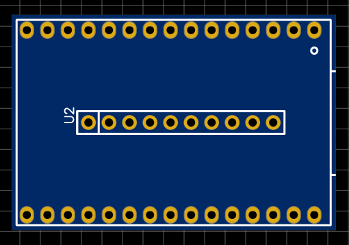
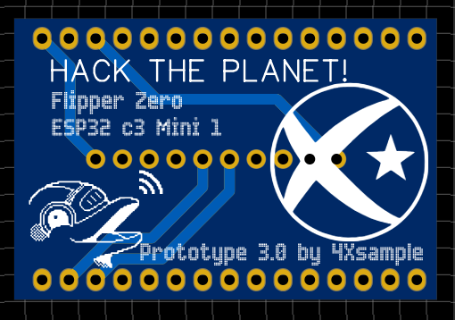

|               |               |               |               |               |               |
|:-------------:|:-------------:|:-------------:|-------------:|-------------:|-------------:|
|  |  |  |  |  |  |

# Disseny PCB per a interfície ESP32 C3 a Flipper Zero

Aquest disseny PCB s'ha creat durant els directes a [Twitch.tv/4Xsample](https://www.twitch.tv/4Xsample), on hem treballat en dues iteracions de prototipatge amb protoboard. Finalment, hem dissenyat el PCB en directe i ara està disponible per connectar l'ESP32 C3 a un Flipper Zero per a realitzar pentesting en xarxes Wi-Fi de 2,4 GHz amb Marauder.

## Vista previa del disseny

### Vista superior

### Vista inferior

## Com obtenir el disseny PCB

El fitxer Gerber es pot trobar en aquesta carpeta de GitHub. Podeu utilitzar aquests arxius per encarregar la vostra pròpia placa PCB. Si voleu fer millores al disseny, obriu fork :)

## Disclaimer: 
*Aquest codi s'ofereix tal com és i no es garanteix que funcioni correctament en totes les condicions. No em faig responsable dels danys que puguin resultar de l'ús d'aquesta informació. Utilitzeu-lo sota la vostra pròpia responsabilitat. Si teniu dubtes pregunteu i respondré al que pugui. Si voleu obrir proposar cambis podeu obrir fork i i voleu seguir-me, al panel del principi d'aquest readme podeu trobar links a les meves xarxes socials, Twitch i PayPal per si també voleu donar suport al meu treball.*