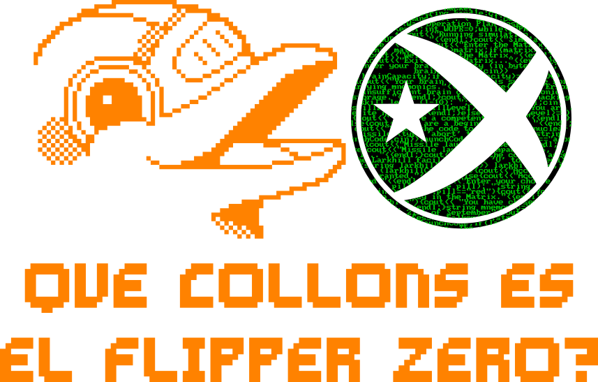

 

|               |               |               |               |               |
|:-------------:|:-------------:|:-------------:|-------------:|-------------:|
|  |  |  |  |  |

<table align="left">
  <tr><th colspan="8">Índex</th></tr>
  <tr>
    <td><a href="#general-">General</a></td>
    <td><a href="#sub-ghz-">Sub-GHz</a></td>
    <td><a href="#nfc--rfid-">NFC & RFID</a></td>
    <td><a href="#infrared-">Infraroig</a></td>
    <td><a href="#badusb-">BadUSB</a></td>
    <td><a href="#ibutton-">iButton</a></td>
    <td><a href="#wifi-board-">Placa WiFi</a></td>
  </tr>
<table>

 
 
 
 
 

|               |               |               |               |               |
|:-------------:|:-------------:|:-------------:|-------------:|-------------:|
|  |  |  |  |  |

 

## Preàmbul [🔝](#top)
- *Aquesta és una FAQ de la comunitat. Si us plau, considera també llegir els [docs oficials](https://docs.flipperzero.one/).*
- *Es va escriure amb informació del firmware més recent de dev, potser hagis de esperar a una llançament (pre) del firmware abans que algunes de les preguntes/respostes siguin rellevants.*
- *Aquest FAQ encara està en desenvolupament, i les aportacions són benvingudes.*
- *Si la teva pregunta no està resposta aquí, **CERCA** al [Discord](https://flipperzero.one/discord) i comprova els missatges fixats abans de fer-la allà.*
- *Tot el que aquí es comenta es nomes aplicable al firmware oficial, altres firmwares poden donar mes opcions de les que hi ha aquí reflexades.

## General [🔝](#top)

### Quina targeta MicroSD hauria de fer servir?
 - Hauria de ser d'una marca de renom (com SanDisk, Sony, etc.) perquè sovint les targetes més barates no admeten del tot el protocol de comunicació que fa servir Flipper.
 - La targeta pot tenir un màxim de 128GB, hauria de tenir una capacitat d'entre 4 i 64 GB, tot i que sincerament amb una targeta de 8 GB ja n'hi ha més que prou.
 - Després d'inserir la targeta, utilitzeu el menú de configuració de Flipper per formatar-la (esborrar-la) i fer-ne una prova.
 - Abans d'expulsar la targeta, desmunteu-la a través del menú de configuració per assegurar-vos que les dades no es corrompin.
 - Llegiu la [documentació oficial](https://docs.flipperzero.one/basics/sd-card) per a més informació!

### Com instalo bases de dades i volcaments?
 Assegureu-vos primer que hi ha una targeta MicroSD que funciona al dispositiu seguint els passos anteriors.
 Un cop hàgiu descarregat el volcat, podeu fer servir qFlipper o l'aplicació mòbil Flipper per a transferir-los. Si esteu transferint un fitxer gran o molts alhora, també podeu expulsar la targeta SD de Flipper i inserir-la al vostre ordinador per a transferències més ràpides.
 - A qFlipper: enchufeu el dispositiu, aneu a la pestanya del navegador de fitxers, navegueu fins a la targeta SD i deixeu anar els fitxers a les carpetes corresponents (els noms de les carpetes són similars a les extensions de fitxer).
 - Per a les aplicacions mòbils: assegureu-vos de estar connectat a través de Bluetooth, deseu el fitxer a l'arxiu de l'aplicació i sincronitzeu-lo de nou al dispositiu.
 - Per a enchufar la targeta SD al vostre PC, deixeu anar els fitxers a les carpetes corresponents (els noms de les carpetes són similars a les extensions de fitxer).

### Com instalo aplicacions i connectors?
 Suposant que l'aplicació s'hagi empaquetat com a fitxer `.fap`, instal·lar-la és tan fàcil com col·locar-la dins del directori `apps` de la targeta SD del vostre Flipper. Podeu iniciar l'aplicació des de l'aplicació `Applications`. Si l'aplicació no s'ha compilat en un `.fap`, compileu-la vosaltres mateixos o *amablement* demaneu a l'autor si ho pot fer.

### Com instalo firmware personalitzats?
 Primer, pregunteu-vos si realment ho necessiteu. Sí, potser sigui divertit sortir dels límits de transmissió de Sub-GHz, però quant sovint ho fareu realment? Val la pena realment trencar la llei?
 Després de ignorar les frases anteriors, assegureu-vos que hi ha una targeta MicroSD que funciona al vostre Flipper i aneu al repositori del firmware preferit. Cercau les publicacions i trobeu el fitxer `.dfu` o el paquet d'actualització (normalment un fitxer `.tar`, `.tar.gz` o `.zip`, sempre conté un fitxer anomenat `update.fuf`).
 - Si només teniu un `.dfu`, ha de ser instal·lat fent servir l'opció "Instal·lar des d'un fitxer" a qFlipper. Seleccioneu el fitxer i inicieu la instal·lació.
 - Si teniu un paquet d'actualització, podeu instal·lar-lo amb qFlipper o fer-ho manualment a través de la targeta MicroSD seguint els passos següents.
 - Per instal·lar manualment un paquet d'actualització, extraieu i transferiu la carpeta (no el fitxer d'arxiu original) al directori `update` de la targeta SD (creeu la carpeta si no existeix ja). Un cop transferida, aneu a l'escriptori/pantalla d'espera del Flipper, premeu cap avall per accedir al navegador de fitxers, després cap a l'esquerra per veure totes les carpetes. Des d'allà, obriu la carpeta `update` (normalment a la part inferior de la llista) i trobeu la carpeta que acabeu de transferir. Finalment, seleccioneu el fitxer anomenat `update` i trieu "Executar a l'aplicació" per instal·lar el firmware.
- Si no hi havia cap fitxer/paquet d'actualització precompilat, haureu de construir vosaltres mateixos el firmware. Vegeu la següent pregunta per a més detalls.
 Per a més informació, llegiu la [documentació oficial](https://docs.flipperzero.one/basics/firmware-update).

### Hi ha arxius amb les sesions de preguntes i respostes del passat?
 L'arxivació és un esforç comunitari, de manera que només n'hi ha algunes disponibles.
 [https://github.com/flipperdevices/flipper-questions-and-answers](https://github.com/flipperdevices/flipper-questions-and-answers)

### Com escric/compilo les meves pròpies aplicacions/connectors/firmware/actius?
<blockquote>
  <em>(El següent és un resum de la <a href="https://github.com/flipperdevices/flipperzero-firmware/blob/dev/documentation/fbt.md">documentació oficial de FBT</a>.)</em> 
  Des de l'introducció de <a href="https://github.com/flipperdevices/flipperzero-firmware/blob/dev/documentation/fbt.md">Flipper Build Tool (FBT)</a>, això s'ha fet molt fàcil! Hauríeu de tenir una comprensió bàsica de treballar a la línia d'ordres abans de continuar. L'única instal·lació prèvia necessària és <a href="https://git-scm.com/downloads">Git</a>. També hauríeu d'haver instal·lat una IDE, es recomana <a href="https://code.visualstudio.com/">VSCode</a> ja que el <a href="https://github.com/flipperdevices/flipperzero-firmware">repositori del firmware</a> té <a href="https://github.com/flipperdevices/flipperzero-firmware/blob/dev/documentation/fbt.md#vscode-integration">fitxers de configuració</a> per a ell.
  

    
Expandeix-me per veure els altres passos.

    <em>(WIP, disculpeu això frena la vostra entusiasme.)</em>
  

</blockquote>

### Puc fer el meu propi Flipper en lloc de comprar-ne un?
 Probablement no. Encara que el firmware i els esquemes són principalment públics, en realitat és molt difícil trobar els components. Moltes peces clau, com ara la pantalla, es van produir específicament per ser utilitzades en la fabricació de Flipper.

### Com aconsegueixo un Flipper amb carrosseria negra?
 Això ja no és possible*, eren exclusius per a patrocinadors de Kickstarter.
 (*Ja no és possible a menys que estigui disposat a pagar centenars de dòlars per un a eBay.)

### Com invertesc la pantalla/canvi la il·luminació de fons/canvi la coberta de l'estoig, etc.
 Aquestes són totes modificacions de maquinari, generalment inaccessibles per a l'usuari mitjà. Busqueu o pregunteu al respecte sobre com fer-ho si esteu realment interessat, [r/flipperzero](https://old.reddit.com/r/flipperzero/) és un lloc excel·lent per començar.

### Hi haurà futures revisions de maquinari?
 Tecnicament parlant, hi haurà una revisió de maquinari **molt menor** a prop futur. Funcionalment parlant, serà idèntica a qualsevol altre Flipper Zero ja venut. La revisió només reemplaça alguns components internos i no ofereix cap nova característica en comparació amb els dispositius existents, de manera que no val la pena esperar a comprar-lo.
 A més a més, hi ha conceptes per a un [Flipper One](https://flipperzero.one/one), però sense un calendari de llançament.

### Què és el mode Dummy?
 Actualment, només permet obrir el joc Snake quan està actiu. En el futur, amagarà totes les aplicacions excepte els jocs, en cas que el vostre dispositiu mai es revisi o s'apoderi.

### El meu dispositiu està congelat, com reinicio/arreglo el problema?
 - Per reiniciar el dispositiu: manteniu premuts els botons BACK i LEFT, i llavors deixeu-los anar simultàniament. Si això no funcionava, *desconnecteu el cable USB* i manteniu premut BACK durant 30 segons. Això realitzarà un reinici normal.
 - Per entrar en el mode DFU/Recuperació: Manteniu premuts BACK i LEFT, i deixeu anar BACK mentre encara manteniu premut LEFT després de uns segons. Quan la pantalla s'il·lumini, podeu deixar anar LEFT.
 - Per sortir del mode DFU/Recuperació: segueix els passos per a un reinici normal sota el primer punt.
 
 Si res no funciona o el dispositiu està completament "cremat", primer assegureu-vos que estigui carregat connectant-lo durant 15-30 minuts. Com a recurs final, si no podeu fer-lo encendre després de carregar-lo, *desconnecteu el cable USB* i manteniu OK més BACK durant 30 segons. **No hi haurà cap indicació**, però el dispositiu ara està en mode de recuperació. Connecteu-lo a un PC i utilitzeu qFlipper per recuperar el firmware.
 Llegiu la documentació oficial de [Control](https://docs.flipperzero.one/basics/control), [Reboot](https://docs.flipperzero.one/basics/reboot) i [Recuperació del firmware](https://docs.flipperzero.one/basics/firmware-update/firmware-recovery).

### Com accedeixo a la CLI/Registres?
<blockquote>
  Per accedir a la CLI de sèrie, feu clic en una de les següents opcions depenent de la vostra plataforma.
  

    
Navegador web d'escriptori*

    <em>*Navegadors Chromium només, com ara: Google Chrome, Microsoft Edge, Opera/Opera GX, Brave i Vivaldi.</em>
    <ul>
      <li>Connecteu el vostre Flipper via USB.</li>
      <li>Assegureu-vos que qFlipper i qualsevol altra terminal sèrie estiguin tancades.</li>
      <li>Obriu <a href="https://my.flipp.dev/">my.flipp.dev</a> en un dels navegadors esmentats anteriorment.</li>
      <li>Feu clic a <kbd>CONNECT</kbd> i seleccioneu "Dispositiu de sèrie USB" de la llista.</li>
      <li>Esperi fins que puguis veure els detalls del dispositiu a la pantalla.</li>
      <li>Seleccioneu l'ítem 💻 CLI del menú lateral esquerre.</li>
      <li><strong>Fet!</strong></li>
    </ul>
  

  

    
Windows

    <ul>
      <li>Instal·la <a href="https://www.chiark.greenend.org.uk/~sgtatham/putty/latest.html">PuTTY</a> si no ho estigués ja.</li>
      <li>Connecta el teu Flipper via USB.</li>
      <li>Obre qFlipper i busca el port COM al costat del nom del Flipper. <em>(Hauria de dir COM seguit d'un número, com ara COM1)</em></li>
      <li>Aprendre el número del port COM.</li>
      <li><strong>TANCA qFlipper</strong>, altrament els següents passos no funcionaran.</li>
      <li>Obre PuTTY i assegura't d'estar a la pantalla de sessió.</li>
      <li>Selecciona "Serial" sota el tipus de connexió.</li>
      <li>Estableix la línia sèrie al port COM. <em>(Només COM seguit del número, com ara COM1)</em></li>
      <li>Estableix la velocitat a <code>115200</code></li>
      <li><em>Opcional: desa la configuració de la sessió per a una connexió fàcil més endavant.</em></li>
      <li>Finalment, fes clic a <kbd>Open</kbd> per entrar a la CLI.</li>
      <li><strong>Fet!</strong></li>
      <li>Si obtens un error "Access Denied", assegura't que qFlipper no estigui en execució!</li>
    </ul>
  

  

MacOS/Linux

    <em>Note: I'm a filthy Windows user without any way to verify this procedure. Let me know if it's wrong!</em>
    <ul>
      <li>Instal·la <a href="https://www.gnu.org/software/screen/">GNU Screen</a> si no ho estigués ja.</li>
      <li>Connecta el teu Flipper via USB.</li>
      <li>Obre qFlipper i busca el camí del dispositiu al costat del nom del Flipper. <em>(Comença amb /dev/tty)</em></li>
      <li><em>Alternativament: executa <code>ls /dev/tty.*</code> en un terminal.</em></li>
      <li>Aprendre el camí del dispositiu complet.</li>
      <li><strong>TANCA qFlipper</strong>, altrament els següents passos no funcionaran.</li>
      <li>Obre un terminal.</li>
      <li>Executa <code>screen PATH 115200</code>, substituint PATH pel camí del dispositiu d'abans.</li>
      <li><strong>Fet!</strong></li>
    </ul>
  

  

Android

    <ul>
      <li>Instal·la <a href="https://play.google.com/store/apps/details?id=de.kai_morich.serial_usb_terminal">Serial USB Terminal</a> si no ho estigués ja.</li>
      <li>Obre l'aplicació i ves a la pantalla de connexions al menú hamburguesa <em>(icona de 3 barres)</em></li>
      <li>Connecta el teu Flipper via USB.</li>
      <li>Fes clic a la icona de refresc si no es mostra automàticament.</li>
      <li>Permet que Serial USB Terminal accedeixi al Flipper si se't demana.</li>
      <li>Si no es connecta automàticament, fes clic a la icona de connectar a la dreta superior. <em>(icona de 2 endolls)</em></li>
      <li><strong>Fet!</strong></li>
      <li><em>Nota: per sortir del mode de registre, hauràs de desconnectar i reconnectar utilitzant la icona.</em></li>
    </ul>
  

  

iPhone

    Malauradament, iOS és incapaç d'accedir a un terminal sèrie per USB; intenta un dels altres mètodes.
  

  A la Flipper, obre la configuració, ves a Sistema i estableix Nivell de registre a Depuració. <em>(Pots mantenir Depuració a Off llevat que algú et demani que l'engeguis)</em>
  Una vegada tens la CLI oberta, escriu <code>log</code> i prem Enter per començar a veure els registres. Prem <code>Ctrl-C</code> o <code>Cmd-C</code> per sortir del mode de registre.
</blockquote>

## Sub-GHz [🔝](#top)

### Com faig per piratar la garatge dels meus veïns o per desbloquejar el cotxe d'alguna persona aleatòria?!?
 Resposta curta: No ho fas. Això és il·legal i NO és per això que va ser dissenyada la Flipper.

### Què vol dir "Aquesta freqüència només es pot utilitzar per RX a la teva regió"?
 A causa de les regulacions legals, la Flipper no està autoritzada a transmetre en determinades freqüències depenent de la ubicació prevista del teu dispositiu.
 La provisió es produeix cada vegada que actualitzes el teu firmware mitjançant qFlipper o l'aplicació mòbil i es basa en la teva ubicació aproximada.

### Com puc trobar la freqüència d'un dispositiu/transponedor?
 Si es tracta d'una freqüència utilitzada comunament, porta el dispositiu *molt a prop* de la Flipper i utilitza l'analitzador de freqüències.
 Si això no funcionà, comprova l'ID FCC del dispositiu. Legalment es requereix que estigui en algun lloc del dispositiu si es ven als EUA.
 A continuació, cerca aquest ID a [FCC ID.io](https://fccid.io).

### No puc sintonitzar la Flipper per capturar una freqüència específica.
 Hauràs de modificar els fitxers `setting_user` i `setting_frequency_analyzer_user` per canviar les freqüències disponibles per a la selecció a l'aplicació. Els fitxers es troben a `subghz/assets` a la targeta SD.
 Tingues en compte que això no desbloquejarà màgicament aquestes freqüències, encara estaràs subjecte a les limitacions del dispositiu.

### Vaig capturar un senyal de garatge/cotxe/etc., però no funciona quan el reprodueixo.
 A menys que l'objecte d'interès sigui molt antic, probablement utilitzi codis de rotació. Llegeix més a continuació.

### Què és un codi de rotació?
 Imagina't això: imagina que el teu garatge està programat per obrir quan rebi el codi "1234" d'un transponedor.
 Aquest seria un codi estàtic, on un atac de repetició (llegeix RAW) seria capaç d'obrir el garatge.
 Com que els atacs de repetició són tan fàcils, la majoria dels dispositius barrejaran el codi després de cada ús.
 Així, la primera vegada que obris el teu garatge, el transponedor envia "1234" i la segona vegada envia "5678".
 Els codis de rotació no són tan senzills, però ja t'has fet una idea.

### Vaig reproduir un codi de rotació i ara la meva targeta/transponedor original no funciona.
 Hauràs de resincronitzar el teu dispositiu vell manualment, ja que ara està endarrerit respecte al codi de rotació.

### Què és un codi Debruin/Brute force?
 Un codi brute force intenta tots els codis possibles per a una longitud de bits específica, però això és poc eficient.
 Exemple: 0001, 0002, 0003, 0004 ... 9998, 9999.
 Les seqüències Debruin són més eficients fusionant múltiples codis junts.
 Exemple: 365, 136, i 650 es poden trobar tots en 13650 mirant grups de 3 dígits individualment.

### Puc adjuntar una antena més potent?
 Sí i no. No pots adjuntar qualsevol antena directament mitjançant els pins GPIO, però podries utilitzar un processador separat en una placa de prototipatge i controlar-lo des de Flipper, suposant que escriguis el teu propi codi per fer-ho.
 Per exemple, podries escriure el teu propi codi en un NRF24 i una aplicació Flipper associada per controlar-lo via GPIO.

## NFC & RFID [🔝](#top)

### Taula de compatibilitat/funcionalitat

| Nom/tipus de targeta | Llegir | Escriure | Desar | Emular     | Notes                                        |
| :------------------- | :----: | :------: | :---: | :-----:    | :------------------------------------------- |
| Mifare Classic       | ✅     | ✅       | ✅     | ✅      | L'emulació pot ser un èxit o un fracàs       |
| Mifare DESFire       | ✅     |          |        |           | Pot llegir fitxers públics                   |
| Mifare Ultralight    | ✅     |          | ✅     | ✅       | Desbloqueja etiquetes amb diversos mètodes   |
| NTAG-21X             | ✅     |          | ✅     | ✅       | Molt similar a Mifare Ultralight             |
| Targetes EMV         | ✅     |          | ❌     | ❌       | Pot llegir targetes de banc no encriptades   |
| NFC-B                |        |          |        | ❌        | No hi ha suport hardware per a l'emulació    |
| iClass/PicoPass      | ✅     |          | ✅     | ❌       | No hi ha suport STM SDK per a l'emulació     |
| EM4100/EM4102        | ✅     | ❌       | ✅     | ✅      |                                              |
| H10301               | ✅     | ❌       | ✅     | ✅      |                                              |
| Indala               | ✅     | ❌       | ✅     | ✅      |                                              |
| T5577                | ✅     | ✅       | ✅     | ✅      |                                              |
| EM4305               | ✅     |          | ✅     | ✅       |                                             |
| Paxton Net2          | ❌     | ❌       | ❌     | ❌      | No hi ha suport per a Hitag2                 |
| Legic Prime          | ❌     | ❌       | ❌     | ❌      | Protocol propietari                          |

***Clau:*** *Marca = ja implementat a la darrera versió oficial del firmware. Sense marca = es podria implementar en el futur. Creu = poc probable que mai es puguem implementar o impossible.*

### Com puc identificar quin tipus de targeta/etiqueta tinc?
 Per determinar el protocol (NFC, RFID o iClass/PicoPass), hauràs de provar a llegir a cada aplicació corresponent. Si no funciona res, comprova l'etiqueta/targeta per veure si hi ha alguna marca o indicació. Com a últim recurs, fes una foto de la targeta/el fob i del lector i pregunta al [servidor Discord de Flipper](https://flipperzero.one/discord).

### Com puc identificar quin tipus d'etiqueta NFC tinc?
 Executa l'acció "Llegir targeta" a l'aplicació NFC. Només es suporten etiquetes NFC-A (Mifare/NTAG/algun EMV).
 Una vegada llegida amb èxit, el tipus d'etiqueta es mostra en negreta a la part superior de la pantalla.

### Quines etiquetes NFC puc escriure?
 Actualment, les Mifare Classic són les úniques targetes NFC que es poden escriure.
 Es podran afegir més amb futures actualitzacions de firmware.

### M'han dit que una etiqueta Mifare Ultralight/NTAG té sectors protegits amb contrasenya. Què vol dir això?
 O bé la lectura s'ha interromput o bé l'etiqueta està realment protegida amb contrasenya.
 Primer, intenta llegir l'etiqueta de nou, però assegura't que es manté a la part posterior del dispositiu fins que aparegui la pantalla d'informació.
 Si segueixes veient l'avís, Flipper pot desbloquejar figurines NFC habilitats amb llei que es pronuncien com "Ameebo" i etiquetes de filtre d'aire Xaomi, però s'ha de tenir en compte que hi ha un risc de "bricking" de l'etiqueta si s'utilitza la contrasenya incorrecta massa vegades.

### Per què tarda tant en llegir una Mifare Classic?
 Les Mifare Classic estan dividides en sectors, que estan protegits per dues claus. Per llegir una Mifare Classic, Flipper fa servir un atac de diccionari, que utilitza una llista gran que actualment està composta per 1241 claus comunes i les comprova individualment contra cada sector de la targeta. Si saps les claus, es poden afegir manualment al Diccionari d'Usuari a "Accions Extra".

### Què significa quan no es poden llegir sectors en una Mifare Classic?
 Les dades en les targetes Mifare Classic es divideixen en sectors i cada sector està protegit per dues claus.
 Si no es poden llegir sectors, llavors l'atac de diccionari de Flipper no ha estat capaç de trobar cap clau vàlida.
 Si saps les claus, pots introduir-les manualment al menú "Accions Extra" de l'aplicació NFC. Altrament, prova d'atacar el lector amb mfkey32v2 com s'explica en les preguntes següents.

### Què significa quan es poden llegir alguns però no tots els sectors en una Mifare Classic?
 Les dades en les targetes Mifare Classic es divideixen en sectors i cada sector està protegit per dues claus.
 La lectura no ha estat un èxit, però tampoc ha fallat. S'han llegit i desat algunes dades de la targeta, però no totes.
 Encara que no es puguin llegir tots els sectors, hauries de revisar la còpia de seguretat amb l'aplicació mòbil per veure si les dades que falten són necessàries o no. En alguns casos molt rares, les targetes semi-llegides es poden emular en lloc de l'original sense problemes.
 Si encara necessites les altres claus, llegeix la següent pregunta.

### Com puc obtenir les claus Mifare Classic des d'un lector amb [mfkey32v2](https://github.com/equipter/mfkey32v2)?
 (WIP, Nota per a mi: https://regex101.com/r/iXmE2N/2)

### Per què no funciona l'emulació de Mifare Classic?
 Flipper emula Mifare Classics segons la documentació especificació oficial (a 13,56 MHz), però alguns lectors de targetes funcionen a freqüències lleugerament diferents (com ara 13,50 MHz). Com que Flipper no pot detectar la freqüència (com ho fa una targeta real), tampoc pot corregir aquests errors menors.
 Com a resultat, la transmissió de dades no sempre es produeix quan el lector s'espera, i per tant l'emulació és imperfecta.
 Hi ha algunes formes teòriques de solucionar això amb programari, però la millor opció requeriria una modificació del maquinari.

### Per què no puc desar/emular Mifare DESFire?
 DESFire és un xip molt complicat i molt més segur. Encara no hi ha atacs coneguts contra ell.

### Quines són les fitxers .shd al directori NFC?
 Són fitxers ombra, i es creen cada vegada que s'escriu una etiqueta emulada.
 Emmagatzemen una còpia del fitxer original amb allò que s'ha escrit. D'aquesta manera, el fitxer original es manté intacte.

### Com edito les dades en una etiqueta desada?
 Necessitaràs un telèfon intel·ligent amb NFC amb una aplicació que pugui escriure etiquetes. Una de les aplicacions més fàcils d'utilitzar es diu NFC Tools, disponible tant per a [Android](https://play.google.com/store/apps/details?id=com.wakdev.wdnfc) com per a [iOS](https://apps.apple.com/us/app/nfc-tools/id1252962749). A causa de les peculiaritats de l'emulació de Mifare Classic, només pot editar les dades d'etiquetes NTAG i Mifare Ultralight desades. Creeu una NTAG216 buida amb l'acció "Afegir manualment" a l'aplicació NFC si encara no en teniu cap. Deseu aquesta etiqueta i obriu-la de la llista. Una vegada que comenceu a emular l'etiqueta, podeu utilitzar l'aplicació NFC Tools del telèfon intel·ligent per escriure informació a l'etiqueta emulada. Això es desa en un fitxer .shd amb el mateix nom que l'etiqueta emulada. Si necessiteu una manera ràpida de generar una etiqueta que contingui una URL, podeu utilitzar l'eina NFC Creator de [Flipper Maker](https://flippermaker.github.io/) en línia.

### Per què la meva targeta bancària no funciona quan l'emulo?
 Les targetes de crèdit/dèbit EMV estan principalment encriptades. La informació que Flipper llegeix és la part no encriptada de la targeta. Això per si sol no és suficient per emular i completar una transacció. És impossible llegir les parts encriptades.

### Hi ha alguna manera de desar i després emular una targeta bancària per autoritzar transaccions?
 No, com s'explica a la pregunta anterior.

### Per què la taula de característiques NFC diu que es poden llegir les targetes bancàries?
 La majoria de les targetes bancàries amb NFC exposeixen el seu número de targeta sense encriptar. La data de caducitat, el CVV i el codi postal no es revelen.
 El número de targeta per si sol no és suficient per crear una transacció, per tant no hi ha cap raó per afegir una opció de desar.

### Pot Flipper emular un terminal de pagament i autoritzar transaccions?
 No. Comenceu a veure un patró aquí?

### On es menciona la característica "USB/LibNFC NFC Reader" al [lloc web del setembre](https://blog.flipperzero.one/september-progress/)?
 Aquesta es va descartar a causa de problemes de temps, més detalls en [aquesta incidència de GitHub](https://github.com/flipperdevices/flipperzero-firmware/issues/1173#issuecomment-1127728562).

### On puc aprendre més sobre la tecnologia NFC i RFID?
 - Introducció tant a les baixes com a les altes frequencies: https://blog.flipperzero.one/rfid/
 - Tipus de NFC https://www.rfwireless-world.com/Tutorials/NFC-Type1-Tag-vs-NFC-Type2-Tag-vs-NFC-Type3-Tag-NFC-Type4-Tag-Types.html
 - Mifare Classic: https://learn.adafruit.com/adafruit-pn532-rfid-nfc/mifare
 - La família Mifare: https://en.wikipedia.org/wiki/MIFARE
 - Fulls de dades: http://www.proxmark.org/files/Documents/
 - Normes i protocols RFID comuns: https://www.asiarfid.com/common-rfid-standards-and-protocols.html
 - Normes RFID: ISO, IEC, EPCglobal: https://www.electronics-notes.com/articles/connectivity/rfid-radio-frequency-identification/standards-iec-iso-epcglobal.php

## Infraroig [🔝](#top)

### Com puc afegir més dispositius al menú "Universals Remotes"?
 Encara que no és possible afegir nous elements al menú universal, hi ha molts repositoris que contenen molts volcats de telecomandes IR. El més popular és [Flipper-IRDB](https://github.com/logickworkshop/Flipper-IRDB).
 (Nota: en descarregar, es *recomana fortament* desmuntar la targeta SD del teu Flipper i connectar-la directament al teu ordinador.) Si només necessiteu una tauleta per a un dispositiu, podeu utilitzar [l'eina de dispositiu IR de Flipper Maker](https://flippermaker.github.io/) per crear-la i transferir-la al moment.

### La tauleta universal de TV no funciona a més del botó d'encès.
 La base de dades universal de la tauleta de TV conté principalment codis d'encès i molt poques coses més. Aquest fitxer (ubicat a `infrared/assets/tv.ir` a la targeta SD) es pot reemplaçar manualment amb un de contenint codis addicionals per a totes les tecles. Per fer-ho, descarregueu [aquest fitxer](https://raw.githubusercontent.com/UberGuidoZ/Flipper/main/Infrared/tv.ir) i utilitzeu qFlipper per transferir-lo a la ruta del text anterior.

### Quins són els codis CSV/Pronto/IR Plus?
 Tots tres són diferents formats de bases de dades d'infrarojos. No són compatibles de forma nativa amb Flipper, però existeixen repositoris que contenen versions convertides i compatibles, com ara [Flipper-IRDB](https://github.com/logickworkshop/Flipper-IRDB).

## BadUSB [🔝](#top)

### Tinc un teclat QWERTY no estatunidenc, com faig perquè els scripts funcionin?
 Fins que es posi en el firmware, la millor opció és intentar utilitzar un dels següents convertidors:
 - [http://helppox.com/badusbconvert.html](http://helppox.com/badusbconvert.html)
 - [https://flippermaker.github.io/](https://flippermaker.github.io/) (BadUSB String To Alt Code)

## iButton [🔝](#top)
 *(WIP)*

## Targeta WiFi [🔝](#top)
 *(WIP)*
