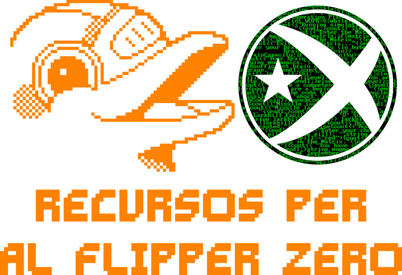

 
 

|               |               |               |               |               |               |
|:-------------:|:-------------:|:-------------:|-------------:|-------------:|-------------:|
|  |  |  |  | 
 |  |

# Recursos de Flipper Zero

Benvingut al meu repositori de recursos de Flipper Zero!

El Flipper Zero és un dispositiu hardware petit i portàtil que us permet provar i demostrar diverses vulnerabilitats hardware i software amb facilitat. És una eina útil per als pentesters, investigadors i educadors que volen demostrar els riscos de l'ús de determinades tecnologies.

He compilat una llista de recursos que he trobat útils i interessants en la meva feina amb el Flipper Zero. Això inclou tutoriels, documentació i altra informació útil.

Espere que trobeu aquests recursos útils! Si teniu qualsevol pregunta o suggeriment, no dubteu en posar-vos en contacte amb mi a Discord o Twitter (enllaços proporcionats a les insignies de dalt d'aquest readme).

Et recomanem que passis a fer un cop d'ull a la [FAQ](./FAQ.md) per obtenir respostes a les preguntes més freqüents.

Si trobeu aquests recursos útils i voleu donar suport a la meva feina, tingueu en compte fer una donació a través de PayPal (enllaç proporcionat a la insignia de dalt d'aquest readme).

Gràcies per passar!

## Firmwares & Tweaks

- [`Unleashed` Firmware amb suport per rolling codes modificacions estables i jocs afegits.](https://github.com/DarkFlippers/unleashed-firmware)
- [`RogueMaster` Fork del Unleashed amb gràfics personalitzats i modificacions experimentals](https://github.com/RogueMaster/flipperzero-firmware-wPlugins)
- [`Flipper-Xtreme` Firmware que agafa codi de tots els firmwares de la escena, millorant-ne la implementació i amb grafics NSFW arreu.](https://github.com/ClaraCrazy/Flipper-Xtreme)
- [`Dexv0` Dexv0 es un firmware senzill i elegant que porta moltissims dumps d'arreu i molt obert a suggerencies de cares a millorar el desenvolupament.](https://github.com/DXVVAY/Dexv0)

## Avís legal

Aquests recursos es proporcionen únicament a títol informatiu. No em faig responsable dels danys que puguin resultar de l'ús d'aquesta informació. Utilitzeu-los sota la vostra responsabilitat.
