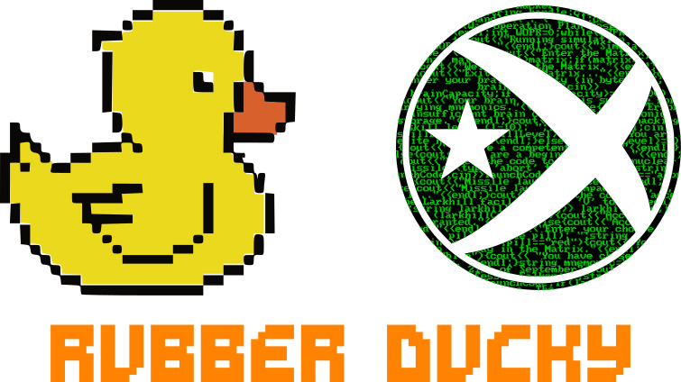

 
 

|               |               |               |               |               |               |
|:-------------:|:-------------:|:-------------:|-------------:|-------------:|-------------:|
|  |  |  |  |  |  |

# Scripts de Rubber Ducky

Benvingut al meu repositori de scripts de Rubber Ducky!

Un Rubber Ducky és un dispositiu USB que es presenta com un teclat al ordinador amfitrió i es pot utilitzar per automatitzar tasques injectant combinacions de tecles prèviament programades. Aquests scripts són útils per als pentesters i investigadors que volen automatitzar determinades tasques en un ordinador objectiu.

Espero que trobeu aquests scripts útils! Si teniu qualsevol pregunta o suggeriment, no dubteu en posar-vos en contacte amb mi a Discord o Twitter (enllaços proporcionats a les insignies de dalt d'aquest readme).

Si trobeu aquests scripts útils i voleu donar suport a la meva feina, tingueu en compte fer una donació a través de PayPal (enllaç proporcionat a la insignia de dalt d'aquest readme).

Gràcies per passar!

## Ús

Per utilitzar aquests scripts, simplement copieu el codi i enganxeu-lo en un fitxer de text. Deseu el fitxer amb una extensió `.txt` i després canvieu-li el nom a `inject.bin` per utilitzar-lo amb un Rubber Ducky.

També podeu deixar el `.txt` dins la carpeta `badusb` del [Flipper Zero](https://flipperzero.one)

Tingueu en compte que aquests scripts es proporcionen tal com són i no puc garantir que funcionin en totes les situacions. Utilitzeu-los sota la vostra responsabilitat.
