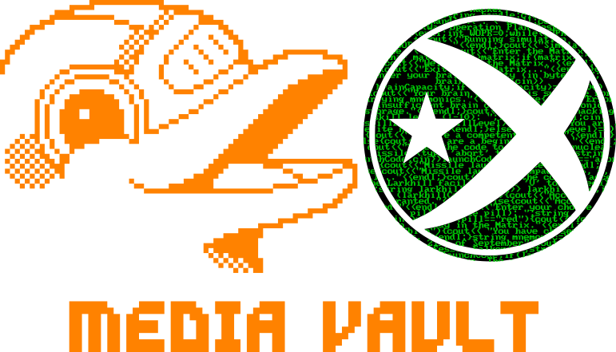

 
 

|               |               |               |               |               |               |
|:-------------:|:-------------:|:-------------:|-------------:|-------------:|-------------:|
|  |  |  |  | 
 |  |

# Carpeta Media
Aquesta carpeta es destina a emmagatzemar les imatges que es fan servir als documents del repositori.

## Fun fact
El logo que es fa servir en aquest repositori conté un text en codi que representa codi escrit en C++ (completament inventat), però que fa referència a diferents pel·lícules:

- War Games
- Johnny Mnemonic
- Matrix
- V de Vendetta

A continuació, es mostra la taula amb el text original que s'ha utilitzat per crear els logos:

| Text sense format | 
|---------------|
| `#include <iostream> #include <cstdio> #include <string> using namespace std; int main(){ cout << "You are a hacker. What's your handle?" << endl; string handle; cin >> handle; cout << "Welcome, " << handle<<"." << endl; cout << "Accessing WOPR (War Operation Plan Response) system..." << endl; int WOPR=0; while(WOPR<100){WOPR++; cout << "Running simulation #" << WOPR << "..." << endl; }cout << "Simulations complete." << endl;cout << "Enter the Matrix (y/n)? "; char matrix; cin >> matrix; if(matrix=='y'){cout << "Welcome to the Matrix." << endl; }else{cout << "Exiting the Matrix..." <<endl; }cout << "Enter your brain capacity (in bytes): ";int brainCapacity; cin >> brainCapacity; if(brainCapacity>=1000000){cout << "Your brain capacity is suitable for carrying mnemonics." << endl; }else{cout << "Error: insufficient brain capacity for mnemonic storage." << endl; }cout << "Enter your hacking skill level (1-10):"; int skillLevel; cin >> skillLevel; if(skillLevel>=8){cout << "You are a elite hacker." << endl; }else if(skillLevel>=5){cout << "You are a competent hacker." << endl; }else{cout << "You are a beginner hacker."<<endl; }cout << "Enter the code to launch the nuclear missile (type 'abort' to cancel): "; string launchCode; cin >> launchCode; if(launchCode=="abort"){cout << "Missile launch aborted." << endl; }else{cout << "Missile launched. Impact in 5, 4, 3, 2, 1..." << endl; }cout << "Enter the code to access the Larkhill facility (type 'V' to proceed): "; string larkhillCode; cin>>larkhillCode; if(larkhillCode=="V"){cout << "Access granted." << endl; }else{cout << "Access denied." << endl; }}cout << "Enter your choice (red pill or blue pill): "; string pill; cin>>pill; if(pill=="red"){cout << "You have chosen to stay in the Matrix." << endl; }else if(pill=="blue"){cout << "You have chosen to leave the Matrix." << endl; }string mnemonic="Remember, remember the 21st of September"; cout << "Greetings professor Falken: "; string launchCode; cin>>launchCode; if(launchCode=="abort"){cout << "Strange game. The only winning move is not to play." << endl; }else{cout << "How about a nice game of chess?" << endl; }` |

## Disclaimer: 
*Aquest codi s'ofereix tal com és i no es garanteix que funcioni correctament en totes les condicions. No em faig responsable dels danys que puguin resultar de l'ús d'aquesta informació. Utilitzeu-lo sota la vostra pròpia responsabilitat. Si teniu dubtes pregunteu i respondré al que pugui. Si voleu obrir proposar cambis podeu obrir fork i i voleu seguir-me, al panel del principi d'aquest readme podeu trobar links a les meves xarxes socials, Twitch i PayPal per si també voleu donar suport al meu treball.*